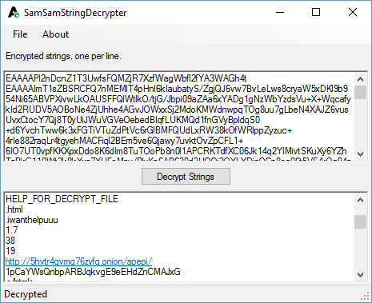

# SamSamStringDecrypter

Simple decrypter for strings used in SamSam Ransomware samples.

## Compiled Executable
Official Download: [BleepingComputer Mirror](https://download.bleepingcomputer.com/demonslay335/SamSamStringDecrypter.zip)

## Dependencies

* [ICSharpDecompiler](https://github.com/icsharpcode/ILSpy/tree/master/ICSharpCode.Decompiler) - Decompiler for C# binaries

#### Note: This is *NOT* a decrypter for files encrypted by SamSam Ransomware. It simply decrypts the strings in the malware's binary for research purposes.